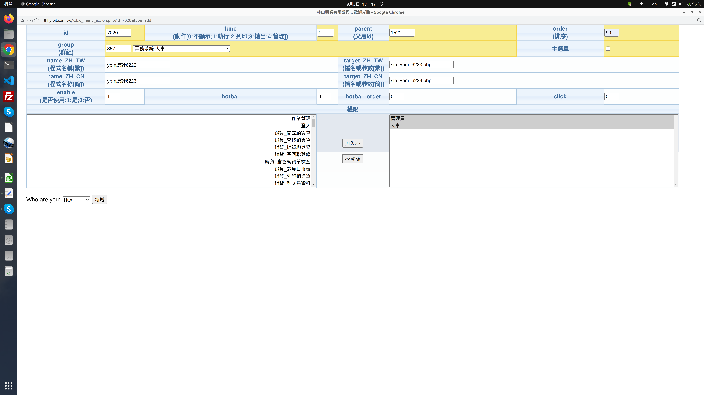

# DIARY

to track my works and thoughts

### @-2022/09/05(月) 高雄-晴
- 呂森民0939125545 龍舟隊教練。屏東竹田人警校畢業消防警官，婚後移居嘉義，來大鵬灣組織屏東縣龍舟隊。
- SchelleyYuki 程序员小姐姐 [分享优质教程2020: 编程入门, 算法, 高效刷题, 系统设计, 前端开发 | 刷题, 找工作, 算法面试](https://www.youtube.com/watch?v=1RzByC1bcuc&list=RDCMUCS1kMgt4igpfjL5lhGvo-fw&index=40)

影片內容摘要

1.0:22 如何編程簡潔抽象 
  The little schema 簡潔編程語言 
2.3:21 算法 應對面試 
  遞歸 迭代 遞歸優化 思維訓練 Mahtias p. NEU 
  算法的學習與訓練 Algo Expert (像leet code) 
  算法認識  算法構思 寫代碼 分析時間空間複雜度 
  cs 研究  BFS廣度優先搜索  DFS深度優先搜索   Bscktracking回溯 
3.6:47 後端開發Back-end 參考書 
  Desingning Data-Intensive Applications 
  asynchronous  
4.8:55 系統設計 System Design 
  #Grokking the System Design Interview 
5.前端開發 Front-End 
  Udemy網路課程  (react js  ) 在職工作者授課 
6.程序員博主介紹 

 

- 博主介紹
  [mayuko](https://www.youtube.com/c/hellomayuko ) |  
  [Coding in Flow](https://www.youtube.com/c/CodinginFlow)  | 
  [Josh and Katie](https://www.youtube.com/c/JoshandKatie)  |  
  [beacoder](https://www.youtube.com/c/beacoder)  |  

- 如何把新程式放入林口興業的程式下執行！
1.把程式放到 lkhy/module下面 (記得程式裡的include都不需要，都註解掉)
2.執行 lkhy/xdxd_menu_manager.php 準備登錄有關程式的資料:
1)標準版: 各家通用的; 客製版:只此家專用的 (我選了這個,-- 點 新增客製區); 工程師:老子在用可能通用 不給一般user用的;

3.填好如圖後，要選擇是誰填的名字，因程序員有時用公用帳號登入！一旦執行後，會秀出語法如下:
<pre>
資料已新增！參考SQL語法如下：
資料已新增！參考SQL語法如下：
xdxd_menu:
INSERT INTO `xdxd_menu` (`id`, `func`, `group`, `parent`, `order`, `name_ZH_TW`, `target_ZH_TW`, `name_ZH_CN`, `target_ZH_CN`, `enable`, `hotbar`, `hotbar_order`, `click`) VALUES (7020, 1, 357, 1521, 99, 'ybm統計6223', 'sta_ybm_6223.php', 'ybm統計6223', 'sta_ybm_6223.php', 1, 0, 0, 0);

xdxd_group:
REPLACE INTO `xdxd_group` VALUES ('10','7020');
REPLACE INTO `xdxd_group` VALUES ('12','7020');
</pre>

- [MarkDown語法大全](https://hackmd.io/@eMP9zQQ0Qt6I8Uqp2Vqy6w/SyiOheL5N/%2FBVqowKshRH246Q7UDyodFA?type=book#MarkDown語法大全)

### @-2022/09/04(日)林口-颱風 
- ubuntu20.04安裝deb-get 參考[Install Third Party DEB Packages With 'deb get'](https://www.youtube.com/watch?v=xkdTMIp3PTg) 用$deb-get help 可看指令參數。在github上找wimpysworld/deb-get 可看到他public的整個project。看他們怎樣開發opensource程式，在github上工作與分享。
- ubuntu20.04安裝OpenShot [How to Install OpenShot Video Editor on Ubuntu 22.04 LTS Jammy](https://www.how2shout.com/linux/how-to-install-openshot-video-editor-on-ubuntu-22-04-lts-jammy/)
- ubuntu20.04安裝OBS studio錄影軟體。看教學影片 [OBS必學第一招-你會使用OBS錄製教學影片嗎?](https://www.youtube.com/watch?v=t5SgWlzjYu0)
- tweetter的用法參考 
<pre>不過一篇只能280字元，中文最多140字，一次可以貼四張圖，每天可以發1000篇推文，貼文不能編輯，創辦人認為最好的編輯就是重發。(雖然之後馬斯克搞不好會新增這個功能)
1. 長按右下角「+」可以推文、可以配GIF推文  、也可以開語音聊天室。
2.可以用「#」來HASHTAG，很有用，雖然可以放好幾個，但推特使用者習慣只放一個HASHTAG，不像IG習慣標到飽。
Q：RT是什麼？🤔
RT = Retweet = 轉推，可以把原推原封不動分享到自己的TL上
Q：看到好棒的推文，怎麼辦？🥰
設書籤，改天看，TL一滑過就無法恢復，推文一期一會，錯過就沒了。</pre>
- 關於srv程式的檢討

	
找出並查看srv程式的功能

	1.htw@htw-B15:~$ find www/lfh -name "*srv*.php" 找出有寫srv的程式
	2.逐一去看這程式的功能
	localhost/lfh/test/htw_srv.php  //srv主程式  
	localhost/lfh/test/htw_srv_mthckemd.php  核對SRV和EMD的人事資料 
	localhost/lfh/test/htw_srv_autorenew.php 
	localhost/lfh/test/htw_srv_autorenew.php.php //從 SRV 取出 202208 月份資料了.... 
	insert error: 
	localhost/lfh/test/htw_srv_chkemd2srv.php //用EMD查查某月的SRV有無資料 
	localhost/lfh/ds/srvmrps.php  //首頁 >統計作業 >BIOS-業務月營績效統計 
	localhost/lfh/ds/newsrv.php   //首頁 >銷貨作業 >建立每月SRV 

- 在github的classroom上，新建這個DIARY.md日記檔案

### @-2022/09/03(土)林口-颱風 
- 花は咲く「わたしは何を残しただろう」。我們都在這塊地上走過，大多數的人無聲無息，有少數人留下了一些痕跡。「私たちは皆この野原を歩きましたが、ほとんどの人は黙って歩き、何人かは足跡を残しました。」
- 關於error log的等級：trace debug info warn error fatal   
[When to use the different log levels](https://stackoverflow.com/questions/2031163/when-to-use-the-different-log-levels/2031209#2031209)
- 我註冊了[Stack Overflow](https://zh.m.wikipedia.org/zh-tw/Stack_Overflow) 帳號了(用gmail帳號)。
- Ubuntu20.04安裝Python 3.10  
<pre>
	sudo apt update && sudo apt upgrade -y
	sudo apt install software-properties-common -y
	sudo add-apt-repository ppa:deadsnakes/ppa -y
	sudo apt install python3.10
	python3.10 --version
</pre>
匯入模組 import。解析Python模組(Module)和套件(Package)的概念 
但是隨著專案模組(Module)的增加，將難以管理及問題的追蹤，這時候就能將模組(Module)打包成套件(Package)，利用其階層式的結構來彈性規劃模組(Module)。在sh/class/mysql/*/py (可用python3 執行*.py程式)

